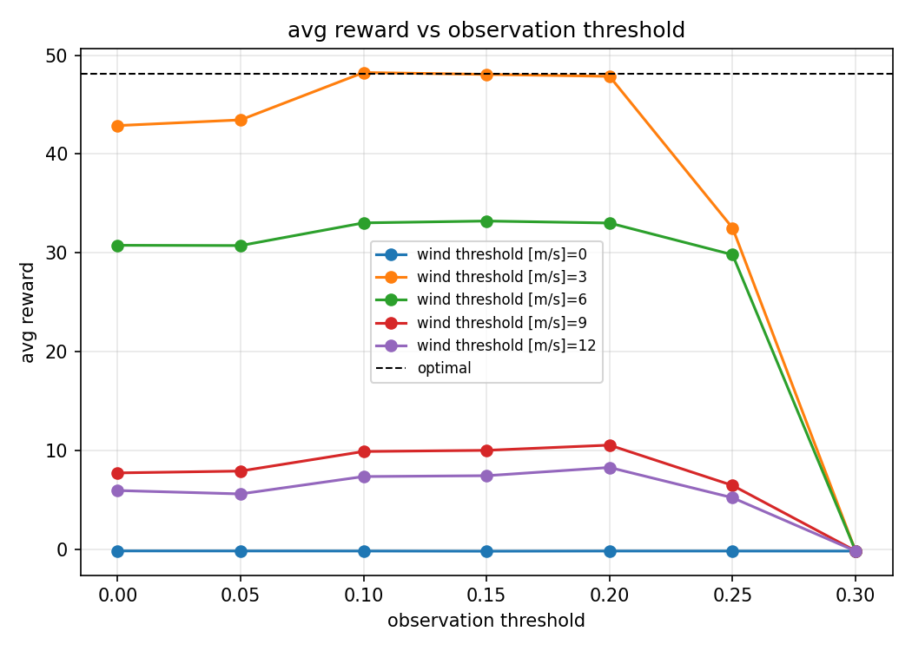
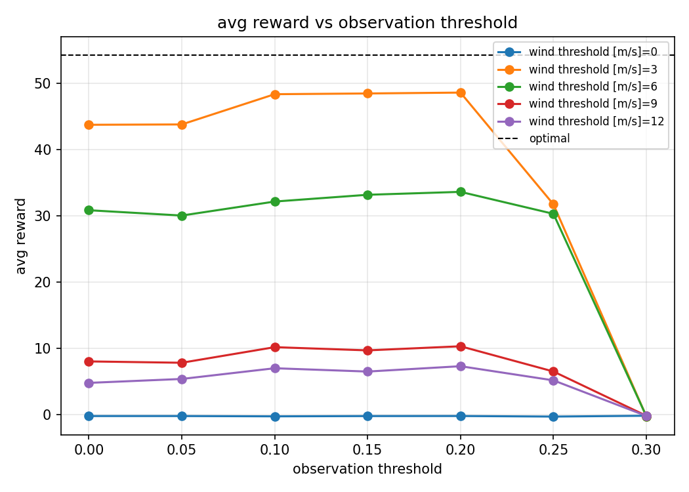
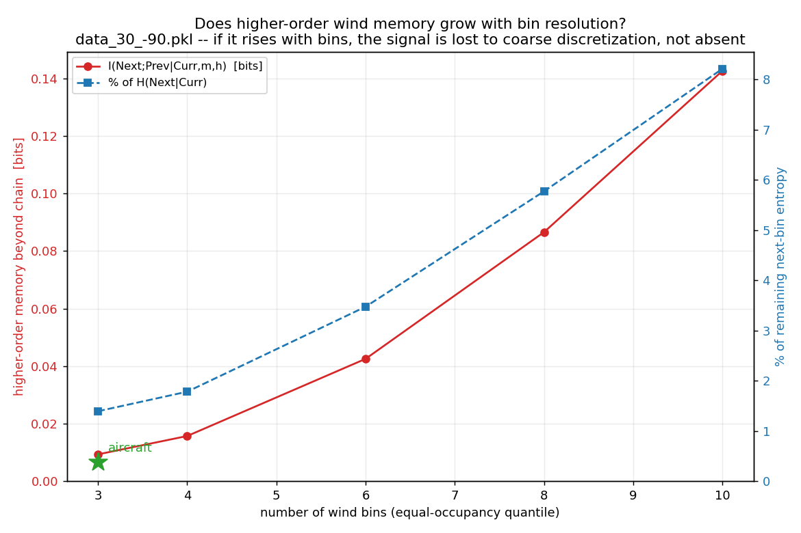
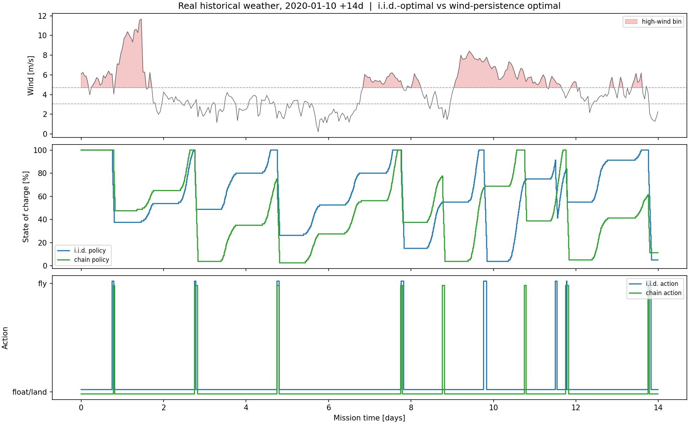

# Wind-Persistence Extension — Change Summary & Advisor Briefing

*Branch: `wind-persistence`. Status: experimental, default **off**. The i.i.d. model
published in the Journal of Aircraft is untouched and exactly reproduced.*

---

## 0. One-paragraph summary

The published model treats wind at each control step as an independent draw from a fitted
(month/hour) Weibull — i.i.d. in time. Real wind is autocorrelated: calm tends to follow
calm, gusty follows gusty. As a curiosity, I asked whether giving the optimal policy
*memory of the current wind regime* would improve decisions. The extension replaces the
per-step i.i.d. wind draw with a **first-order, time-conditioned Markov chain over
wind-speed bins**, and adds the current wind bin as an exogenous state variable in the
value function. It is a strict superset of the published model (with one bin it is exactly
i.i.d.), it is off by default, and on **real historical weather** it produces a measurable,
replicated improvement — while a companion diagnostic shows we do *not* need anything more
elaborate than first order. Net: a small, bounded investigation that both improved the
algorithm and told us where the ceiling is.

---

## Part A — Full briefing

### 1. What changed on the branch

The `wind-persistence` branch also carries a lot of *unrelated* history (the journal-paper
figures, the solver vectorization, the historical block-bootstrap harness). The
**wind-persistence-specific** work is just these commits:

| Commit | What it adds |
|---|---|
| `d73b543` | **Core model** — Markov-modulated wind persistence (time-conditioned chain) |
| `81e3d4d` | User-specified wind bin edges in YAML; auto-rebuild of stale chain artifacts |
| `1b8c1fc`, `0460bf4` | Plumbing fixes for chain-artifact auto-provisioning / naming |
| `cf97ca9` | Wind-persistence pre-check scripts; drop hard-coded bin edges from the example |

**Files touched by the core model (`d73b543`):**

- `BaseClasses/backward_induction_base.py` — the value table gains an optional wind-bin
  dimension: `(num_states, horizon)` when i.i.d., `(n_bins, num_states, horizon)` when the
  chain is on. Separate `_solve_iid()` / `_solve_chain()` paths. Next-stage value is a
  bin-weighted expectation through the transition matrix; the failure probability keeps a
  **continuous within-bin** (truncated, renormalized Weibull) integral so the steep
  failure curve stays resolved.
- `BaseClasses/environment_provider_base.py` — per-lane current-bin state, within-bin
  truncated-Weibull sampling, chain advance via the transition row, and an exact i.i.d.
  fallback when no chain is supplied.
- `BaseClasses/run_sim.py` — `EnvironmentLoader` maps each stage's `(month, hour)` to its
  fitted transition matrix; config gate `wind_chain: {enabled, path}`, default off.
- `BaseClasses/simulation_base.py` — the optimal `choose_action_batch` conditions the
  future value on the current bin and stage transition matrix. **Threshold policies are
  unchanged** (they never see the bin).
- `Scripts/create_weather_distributions.py` — `fit_wind_transition_chain` /
  `build_wind_chain_artifact`: fit bin edges + `(month, hour)`-conditioned transition
  matrices from the historical record and save a companion pickle.
- `Tests/verify_wind_chain.py` — behavioral checks (below).

**Supporting tooling:** `Scripts/build_windchain.py` (CLI to build the artifact),
`Scripts/wind_persistence_precheck.py` + `wind_persistence_plots.py` (the higher-order
diagnostic), and the harness examples `journal_threshold_vs_optimal_chain_historical.yaml`
and `chain_small.yaml`.

### 2. How it works (one screen)

*Full formalism — augmented MDP, Bellman recursion, within-bin truncated Weibull, chain
fitting, and the i.i.d. reduction — is in [`wind_persistence_math.md`](wind_persistence_math.md).*

- **Bins govern persistence; within-bin stays continuous.** Wind speed is binned (default
  3 equal-occupancy quantile bins). The *bin* follows a Markov chain; *within* a bin, wind
  is still drawn from the truncated, renormalized Weibull, so the failure integral is as
  sharp as before.
- **Time-conditioned transition matrices.** Transitions are conditioned on `(month, hour)`
  — a `(13, 24, n_bins, n_bins)` array, i.e. 288 matrices. Each mission stage uses the
  matrix for its own calendar month/hour, so diurnal and seasonal structure is *already*
  modeled by the chain (this matters for the diagnostic in §4).
- **State augmentation, not a fix.** The current wind bin becomes an exogenous state
  variable. This *preserves* the Markov property by enlarging the state; it does not
  "correct" a broken assumption — the i.i.d. model was internally consistent.
- **Strict superset.** `n_bins == 1` is a separate, unchanged code path that reproduces the
  published i.i.d. results exactly. Solar remains i.i.d. in this version.
- **Cost.** Roughly `O(n_bins)` more work in both the backward-induction solve and the
  rollout (the value table and the per-step lookup each scale with the number of bins).
  Default off ⇒ zero impact on the published pipeline.

### 3. Behavioral sanity checks (`verify_wind_chain.py`)

- A **rank-1** chain (every row identical) collapses to i.i.d. within Monte-Carlo error
  (|Δfailure%| < 3 pp, |Δreward| < 0.5) — confirms the superset claim numerically.
- The within-bin mixture reproduces the full Weibull marginal.
- A **persistent** chain makes the value table fall monotonically with wind bin (a
  high-wind regime is worth less) and shifts the failure/reward statistics — confirms the
  bin state actually informs the policy.

### 4. What we found (empirical, from existing `results/` runs)

All numbers below are from runs already on disk under `results/`, evaluated on **real
historical weather** (lat 30 / lon −90, 1950–2022, drawn as 7-day blocks), battery 300 Wh,
failure penalty 5. The threshold and optimal policies were evaluated under identical
conditions; the only difference between the i.i.d.-optimal and chain-optimal columns is
whether the optimal policy was *solved* with the chain. The threshold operating point is
the **best-average-reward** row of the threshold sweep (reward is the objective; the
failure penalty is already inside it).

| Horizon | Policy | Avg reward | Failure % | Flight hrs |
|---|---|---|---|---|
| 3000 | tuned threshold (obs 0.15, w 3) | 36.9–37.1 | 19.5–19.7% | 43.6–43.8 |
| 3000 | i.i.d.-optimal | 38.2 | 41.8% | 38.3 |
| 3000 | **chain-optimal (wind persistence)** | **42.5–42.6** | 35.2% | 43.7 |
| 4000 | tuned threshold (obs 0.1–0.2, w 3) | 48.3–48.6 | 23.5–25.7% | 55.8–57.0 |
| 4000 | i.i.d.-optimal | 47.1–48.1 | 47.6–49.5% | 48.1–49.0 |
| 4000 | **chain-optimal, quantile bins** | **53.8–54.3** | 39.7–41.9% | 56.4–56.9 |
| 4000 | chain-optimal, **[5, 10] m/s bins** | ~3.2 (≈grounded) | ~11% | ~5.5 |

Ranges reflect Monte-Carlo spread across repeated runs (1k–30k episodes). Source files:
`results/journal_threshold_vs_optimal_chain_historical/*/summary.csv` and
`results/journal_threshold_vs_optimal_historical/*/summary.csv`.

In each figure below the colored curves are the **threshold heuristic** swept over
observation- and wind-thresholds; the dashed line is the **optimal** policy. The contrast
between the two figures is the whole argument:

**i.i.d.-optimal vs threshold** — the dashed optimal line sits *right on top of* the best
threshold curve. Solving the MDP under i.i.d. buys essentially nothing over a tuned
heuristic on real weather:

**chain-optimal vs threshold** — the dashed optimal line now sits clearly *above* the entire
threshold family. Adding wind persistence is what makes the optimal policy actually win:

*Both at h=4000, same real historical weather. Companion sweeps for failure rate and flight
hours exist for each case:
`figures/sweep_failure_threshold_vs_{iid,chain}_optimal.png`,
`figures/sweep_flight_hrs_threshold_vs_{iid,chain}_optimal.png`.*

**Four readings of this table:**

1. **Chain-optimal has the highest reward of all three policies, at both horizons**, and it
   beats the i.i.d.-optimal policy on *every* axis at once — lower failure, higher reward,
   *and* more flight hours (≈5–9 pp lower failure, +10–15% reward, +5–8 flight-hours). It
   survives more *and* flies more.

2. **The "so what."** On real weather at the long horizon, the i.i.d.-optimal policy gives
   essentially **no reward advantage over a well-tuned threshold heuristic** (≈48 vs ≈48.5)
   — solving the full MDP barely earns its keep. Adding wind persistence is what turns
   "optimal ≈ heuristic" into "optimal clearly wins" (≈54). The extension is what makes the
   optimal policy worth the trouble on real data. *(Caveat: the policies sit at different
   failure/flight operating points — the optimal flies more aggressively for more reward —
   which is why all three metrics are shown rather than a single scalar.)*

3. **Bin definition is the real lever — not chain order.** Equal-occupancy quantile bins
   give the gain above. Coarse aircraft-threshold bins `[5, 10] m/s` — where almost all
   wind at this site falls into one bin — make the policy degenerate to near-grounded
   (reward ≈ 3). The chain only helps when the bins actually resolve the part of the
   distribution where decisions change.

4. **A diagnostic says first order is enough.** `wind_persistence_precheck.py` measures the
   *higher-order* wind memory left after the chain — the conditional mutual information
   `I(Next ; Prev | Curr, month, hour)`. At the coarse bins the policy can exploit, the
   previous bin adds only **~1.4–2%** of the remaining entropy beyond the current bin. So a
   first-order chain captures essentially all the *exploitable* persistence; the residual
   structure grows with bin **resolution**, not with deeper history. *(Caveat: high-bin MI
   magnitudes are inflated by finite-sample bias and need a Miller–Madow / shuffle-null
   correction before they go in a paper.)*

*Higher-order memory beyond the first-order chain, `I(Next ; Prev | Curr, month, hour)`, as
a function of bin resolution. At the coarse bins the policy uses (3 quantile bins, or the
aircraft `[5,10]` operating point marked low-left) the residual is ~1–2% of the remaining
entropy; it only grows as bins get finer — i.e. the missing structure is in resolution, not
in deeper history. The ACF/PACF + Markov-order panel is at
`figures/precheck_acf_pacf_markov_panel.png`.*

These last two points line up: **first-order persistence is substantial** (it drives the
table), while **higher-order memory is negligible** (≈1–2%) and the remaining headroom is
in representation richness (finer/continuous wind, and eventually solar), not in a longer
Markov memory.

**The mechanism, on one real two-week window:**

*Both policies replayed deterministically on the *same* historical wind/solar window
(high-wind bin shaded). The two policies (blue = i.i.d., green = chain) follow similar
state-of-charge paths most of the time but diverge around weather transitions — the
chain-aware policy anticipates persistence of a high-wind spell and commits/abstains a step
earlier. This is the per-episode picture behind the aggregate gains above; regenerate with
`Scripts/compare_policies_episode.py`.*

### 5. Why it was worth doing

- **Diligence on a now-published model.** It's a direct check that the i.i.d. assumption
  didn't leave material performance on the table. The honest answer — "i.i.d.-optimal only
  ties a tuned heuristic on real weather, but persistence breaks the tie" — is exactly the
  kind of result that strengthens, not undermines, the published work.
- **A bounded, reusable result.** We now have (a) a measured improvement, (b) a clean
  characterization of *why* and *how much* (first order + good bins; deeper history doesn't
  pay), and (c) a reusable diagnostic (`wind_persistence_precheck.py`) that generalizes to
  any future weather-memory question. That is a candidate short follow-up note or thesis
  section, not wasted effort.
- **Infrastructure for the genuinely promising next step.** State augmentation +
  time-conditioned chains + historical block-bootstrap evaluation are exactly what a
  **solar-persistence** extension needs — and solar is where the bigger prize likely is,
  since multi-day cloud spells, not gusts, drive battery-depletion failure. Ideally a joint
  wind–solar regime chain (storms are both windy *and* cloudy).

### 6. Honest scope / limitations

- One site (lat 30 / lon −90) and effectively one season window (start d161). Generality
  across latitudes/seasons is untested.
- Optimal and threshold policies are compared at different failure operating points; reward
  (penalty-inclusive) is the apples-to-apples objective, but the trade-off should be shown,
  not hidden.
- The high-resolution MI numbers need a bias correction before publication.
- Solar is still i.i.d.; the largest remaining modeling gap is probably there.

---

## Part B — Talking points & objection/response

### Talking points (for the meeting)

- The published i.i.d. model is untouched and exactly reproduced (`n_bins == 1`); this is a
  default-off experimental branch.
- I asked one question — does giving the policy memory of the current wind regime help? —
  and answered it both empirically and with a diagnostic.
- On real historical weather, the chain-aware optimal policy is the best of three policies
  on reward, at two horizons, and beats the i.i.d.-optimal on failure, reward, and flight
  hours simultaneously.
- The sharp point: i.i.d.-optimal barely ties a tuned threshold heuristic on real weather;
  wind persistence is what makes "optimal" actually win.
- A pre-check shows higher-order wind memory is ~1–2% — so first order is the right
  complexity; we don't need a deeper chain.
- The lever that *does* matter is bin resolution: quantile bins help, coarse fixed bins can
  backfire (near-grounded policy).
- All of this is the exact scaffolding for the bigger fish — solar/storm persistence.

### Objection → response

| Likely objection | Response |
|---|---|
| *"The paper's already accepted — why spend time on this?"* | It's a diligence check, it's bounded, it produced reusable tooling, and it doesn't reopen the paper: the chain is off by default and reproduces i.i.d. exactly. |
| *"Does this mean the i.i.d. model was wrong?"* | No. The i.i.d. model is internally consistent. This *augments* the state to add persistence and keeps the Markov property; `n_bins == 1` reproduces the published results exactly. |
| *"Does it actually help, or is it just more machinery?"* | Three-way on real weather: chain-optimal has the highest reward at both horizons and beats i.i.d.-optimal on failure, reward, and flight-hours together. And i.i.d.-optimal ≈ tuned threshold on real weather — the chain is what makes optimal beat the heuristic. |
| *"Persistence should obviously help — isn't the higher-order signal you measured tiny?"* | Two different quantities. First-order persistence is large (it drives the gains). The ~1–2% is *higher-order* memory beyond first order — and its being small is the good news: first order is the right complexity. |
| *"Then was building the chain pointless?"* | No — it gave a measurable gain *and* bounded the design space: first order + resolution-matched bins is the sweet spot; deeper history isn't worth it; the next real lever is finer/continuous wind state and, more importantly, solar persistence. |
| *"What about compute cost / risk to the existing pipeline?"* | ≈ `O(n_bins)` extra in solve and rollout, default off, zero effect on the published pipeline. |
| *"How robust is the result?"* | Replicated across horizons and 1k–30k-episode runs at one site/season. I'm explicit that multi-site/season generality and a finite-sample MI bias correction are open items. |

---

*Numbers in §4 are pulled directly from `results/journal_threshold_vs_optimal*_historical/`
summary CSVs; the diagnostic is `SolarSimulator/Scripts/wind_persistence_precheck.py`.*
