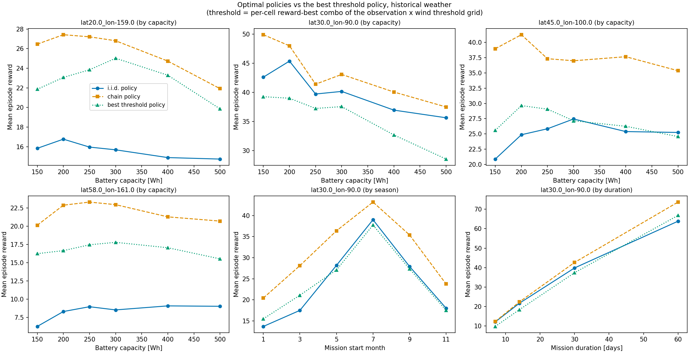

# Threshold-Policy Benchmark — IID-Optimal vs Chain-Optimal vs Tuned Threshold

*Branch: `wind-persistence`. Run date: 2026-07-02/03. Companion to
[`wind_persistence_briefing.md`](wind_persistence_briefing.md) (single-site result) — this
document extends the three-way comparison to the full multi-location / multi-scenario sweep.*

> **Note on artifacts:** the original 3-bin run's outputs under
> `results/chain_vs_iid_sweep/` were deleted after the analysis to free disk; the numbers
> in §§3–5 were recorded from that run. The directory now holds the **4-quantile-bin
> rerun** (§9), whose figures are embedded below and live in `_analysis/figures/`.
> Everything is reproducible from the commands in §7.

---

## 1. Question

The single-site briefing result was: *on real historical weather, the i.i.d.-optimal policy
barely ties a tuned threshold heuristic, and adding wind persistence (the chain) is what
makes the optimal policy actually win.* Does that hold across locations, battery
capacities, start months, and mission durations — the same 34 scenarios already run for the
chain-vs-iid sweep?

## 2. Benchmark design

- **Scenarios:** every historical-weather cell of the existing sweep — 4 locations × 6
  capacities (capgrid), 6 start months (startdate), 4 durations (duration) = **34 cells**,
  3,000 episodes each.
- **Threshold grid:** observation thresholds {0, 0.05, 0.1, 0.15, 0.2, 0.25, 0.3} ×
  wind thresholds {0, 3, 6, 9, 12} m/s = **35 combos per cell**. Total: 6 configs,
  **1,190 simulations, 3.57 M episodes** (~5.5 min per 210-sim config; ~35 min wall).
- **One arm-agnostic config per scenario.** Threshold policies never see the wind chain, so
  a single threshold run serves as the benchmark for *both* optimal arms
  (`include_optimal: false` skips the solve entirely — no value tables are built).
- **Episode-paired comparison (common random numbers).** The historical bootstrap provider
  re-seeds `default_rng(0)` per batch, so threshold episodes see **byte-identical bootstrap
  weather** to both optimal arms, episode-for-episode. Verified empirically: a one-off
  8-full-history run had `wind_series` allclose to the optimal arm's in 8/8 episodes. All
  deltas below are paired per-episode differences with percentile-bootstrap 95% CIs.
- **Best-threshold selection, two ways per cell:**
  - *reward-best* — the combo with the highest full-sample mean reward (used for reward
    comparisons; reward includes the failure penalty, so it is the objective);
  - *min-failure* — the combo with the lowest failure rate (used for the reliability
    envelope in the capacity–reliability figure).
- **Winner's-curse control.** Selecting the best of 35 combos on the same episodes it is
  evaluated on inflates its score. A split-half check (select on even episode indices,
  evaluate on odd) showed the selection is **stable in 25/34 cells** and the holdout reward
  is within ~0.5 of the full-sample value everywhere — negligible next to the effect sizes.

## 3. Headline results (34 historical cells)

| Comparison (paired, 95% CI excludes 0) | Wins | Losses |
|---|---|---|
| **chain-optimal vs best threshold** | **30 / 34** | 2 (both at Hawaii: 300 Wh −1.71, 400 Wh −1.02) |
| **iid-optimal vs best threshold** | 13 / 34 | **19** |

- Chain-optimal margins over the best threshold in the capacity grid run **+3.5 to +12.4
  reward** per episode.
- The iid-optimal policy **loses to a tuned heuristic in the majority of scenarios**. This
  is the multi-scenario version of the briefing's sharp point: solving the full MDP under
  the i.i.d. wind assumption is often *worse* than sweeping a two-parameter threshold rule
  on real weather. Adding wind persistence restores the optimal policy's dominance almost
  everywhere.
- The two chain losses are both at the Hawaii trade-wind site — diagnosed in §5.

## 4. Risk-posture caveat (read before quoting failure rates)

With `failure_penalty = 5.0`, the optimal policies deliberately accept high failure rates
in exchange for reward. The *min-failure* threshold combos achieve ~2% failure in every
cell — but they do it by almost never flying (mean reward ≈ −0.1). The reward-vs-risk
pictures **cross**: e.g. at the Gulf site, 300 Wh, the best threshold has better worst-decile
performance (CVaR₁₀ 6.3 vs chain 3.3) but a much worse upper half of the reward CDF. Reward
(penalty-inclusive) is the objective and the honest scalar; failure % alone compares
policies at different operating points. The capacity–reliability figure (fig 1) therefore
uses the min-failure envelope for the threshold curve, while the reward comparisons in §3
use the reward-best combo.

## 5. Why the threshold beats the chain at Hawaii: within-bin information loss

Paired decomposition at Hawaii (lat 20 / lon −159), 300 Wh, 3,000 episodes, best threshold
combo (obs 0.15, wind 6 m/s). Mean Δreward (chain − threshold) = **−1.71**:

| Outcome pattern | Share of episodes | Contribution to Δ |
|---|---|---|
| chain fails, threshold survives | 26.0% | **−6.5** |
| threshold fails, chain survives | 22.1% | +5.0 |
| both survive (threshold earns +3.85 more) | — | −0.7 |
| both fail | — | +0.5 |

The chain policy fails **more** (59.7% vs 55.8%) while flying **less** (30.7 vs 32.6 h) —
it is not merely more aggressive; it is mis-timed at this site.

**Root cause.** The value function conditions on the wind *bin* with edges [5, 10] m/s, but
July Hawaii trade winds sit **above 6 m/s 48% of the time — almost all of it inside the
5–10 mid bin**. The threshold policy's 6 m/s cutoff conditions on the *continuous* wind
value, exactly the information the bin discretization throws away.

**It is not a chain-fitting error.** The chain's implied top-bin (≥10 m/s) mean spell
duration is 4.8 h — matching the empirical 4.8 h exactly. But spells of ≥6 m/s (the
decision-relevant level, invisible to the bin structure) are heavy-tailed: mean 15.2 h,
p90 42 h vs 34 h for a geometric fit of the same mean, max 345 h.

This is precisely the conclusion of the earlier pre-check
([`wind_persistence_briefing.md`](wind_persistence_briefing.md) §4, point 4): **the
remaining memory lives in bin *resolution*, not in deeper bin *history*.** The predicted
fix is finer, site-appropriate `bin_edges` (e.g. [4, 6, 8, 10] m/s at Hawaii — the config
already supports per-config edges); a single-cell rerun would confirm.

## 6. Tooling added for this benchmark (all in `Scripts/`)

- `generate_chain_sweep_configs.py --thresholds` — emits the 6 arm-agnostic threshold
  configs alongside the optimal-arm pairs; manifest records the grids.
- `run_chain_sweep.py` — **auto-compaction**: scalars-only runs (no `save_states`, no
  full-history episodes) are compacted after each config — per-episode scalars are cached
  to `_episode_scalars.csv` and the HDF5 deleted (a 210-sim scalar-only h5 still carries
  ~1.7 GB of per-dataset metadata; the CSV is ~40–70 MB). `--keep-h5` opts out.
- `compare_chain_sweep.py` — per-cell best-threshold selection (both criteria), split-half
  stability check, paired three-way deltas with CIs
  (`d_total_reward_{iid,chain}_vs_thresh` ± CI columns), report section
  "Optimal arms vs best threshold policy", `capacity_at_reliability()` for the
  Wh-saved-at-equal-reliability comparison.
- `plot_chain_sweep.py` — threshold benchmark (green, dotted, ^) added to fig 1
  (reliability envelope) and fig 3 (reward CDFs); new **fig 8**: 2×3 three-way mean-reward
  grid (4 location capacity panels + start month + duration).
- **Storage policy** (applies to all sweep configs): `full_history_episodes: 0` and
  `save_states: false` everywhere except the baseline-location capgrid historical pair,
  which keeps 64 full-history episodes — the only data consumed by the event-aligned
  composite figure (fig 6), trajectory replays, and the CRN `--verify` check (which now
  reports history-less pairs as inconclusive and moves on instead of failing).

## 7. Reproduction

```bash
# from SolarSimulator/, in the pvlib conda env
conda run -n pvlib python Scripts/generate_chain_sweep_configs.py --thresholds
conda run -n pvlib python Scripts/run_chain_sweep.py --resume        # optimal + threshold configs
conda run -n pvlib python Scripts/compare_chain_sweep.py --verify    # cells CSV + report
conda run -n pvlib python Scripts/plot_chain_sweep.py                # figs 1..8
```

Outputs land in `results/chain_vs_iid_sweep/` (per-config run dirs with `summary.csv` +
`_episode_scalars.csv`) and `results/chain_vs_iid_sweep/_analysis/` (`comparison_cells.csv`,
`comparison_report.md`, `figures/`). See `harness/README.md` for the underlying experiment
harness and the smoke-test variant (`--smoke` end-to-end in ~10–15 min).

## 8. Takeaways (3-bin run)

1. **The motivation for the chain is now multi-site:** iid-optimal loses to a tuned
   two-parameter heuristic in 19/34 real-weather scenarios; chain-optimal beats the
   heuristic in 30/34.
2. **Where the chain loses, the diagnosis is representation, not persistence order** —
   coarse bins discard the continuous wind level exactly where a trade-wind site needs it,
   consistent with the pre-check's "resolution, not history" conclusion.
3. **Open items:** confirm the Hawaii fix with finer bin edges (single-cell rerun);
   consider site-adaptive (quantile) bin edges as the default; the threshold benchmark
   makes a natural third curve in any thesis/paper figure.

## 9. Rerun with 4 quantile bins (2026-07-03): the Hawaii diagnosis confirmed

The full sweep (all 30 configs, same scenarios, seeds, and threshold grid) was rerun with
one change: `wind_chain: {n_bins: 4}` and **no** explicit `bin_edges` — equal-occupancy
quantile bins derived per location from its own historical record at artifact-build time.
The fitted interior edges (m/s):

| Location | Quantile edges (4 bins) | Old fixed edges |
|---|---|---|
| Gulf (lat 30 / −90) | 2.65, 3.85, 5.23 | 5, 10 |
| Hawaii (lat 20 / −159) | 4.11, 5.67, 7.34 | 5, 10 |
| Continental (lat 45 / −100) | 2.91, 4.30, 6.01 | 5, 10 |
| Bering (lat 58 / −161) | 4.84, 7.24, 9.90 | 5, 10 |

Note what happened at Hawaii: the quantile edges land at 4.1 / 5.7 / 7.3 m/s — exactly
bracketing the ~6 m/s decision band that the old 5–10 bin pooled into one state.

**Results (34 historical cells, paired 95% CIs):**

- **chain-optimal beats the best threshold in 34/34 cells** (was 30/34). Both Hawaii
  losses flipped decisively: 300 Wh **+1.78** [0.94, 2.63] (was −1.71); 400 Wh
  **+1.44** [0.72, 2.18] (was −1.02). Capacity-grid margins now span +1.4 (Hawaii
  400 Wh) to +13.4 (continental 150 Wh).
- **iid-optimal still loses to the tuned heuristic in 19/34 cells** (wins 11) — as
  expected, the iid arm is untouched by bin choice; the entire improvement is the chain
  arm's representation.
- Split-half best-threshold selection stable in 24/34 cells; holdout rewards within ~0.5
  of full-sample everywhere (winner's-curse bias again negligible).
- CRN verification passed (8/8 full-history episodes byte-identical weather across arms).
- `Tests/verify_wind_chain.py` passes on the 4-bin artifacts (rank-1 collapse to i.i.d.,
  value monotone in wind bin).



*Mean episode reward across the capacity grid (four locations) plus start-month and
duration sweeps: i.i.d.-optimal (blue), chain-optimal (orange), best tuned threshold
(green). With site-adaptive quantile bins the chain curve is on top in every panel.
Companion figures: `capacity_reliability_frontier_4qbin.png` (reliability envelope),
`reward_cdf_cvar_4qbin.png` (tails/CVaR).*

**Caveats for cross-run comparison.** Between the two sweeps the codebase gained the
in-progress solar-chain refactor, which shifted RNG stream ordering: per-episode draws are
no longer bit-identical to the 3-bin run, so comparisons *against the recorded §3–§5
numbers* are approximate (MC error ~±0.2 reward on 3,000-episode means). All deltas and
CIs *within* the 4-bin run are exactly episode-paired. The 3-bin run's per-episode data
was deleted, so a paired 3-vs-4-bin decomposition would require rerunning the chain arm at
3 bins.

**Sensitivity conclusion.** Bin *placement/resolution* was the binding constraint, and
site-adaptive quantile bins remove it without any per-site tuning: every conclusion the
3-bin sweep supported survives, the four cells it got wrong flip, and no cell got worse
by more than MC noise. First-order chain + 4 quantile bins is a sensible no-tuning
default; the remaining principled-selection ideas (decision-aware edges, predictive-
information criteria) are documented in the meeting notes and only worth pursuing if a
site shows quantile bins still leaving reward on the table.
